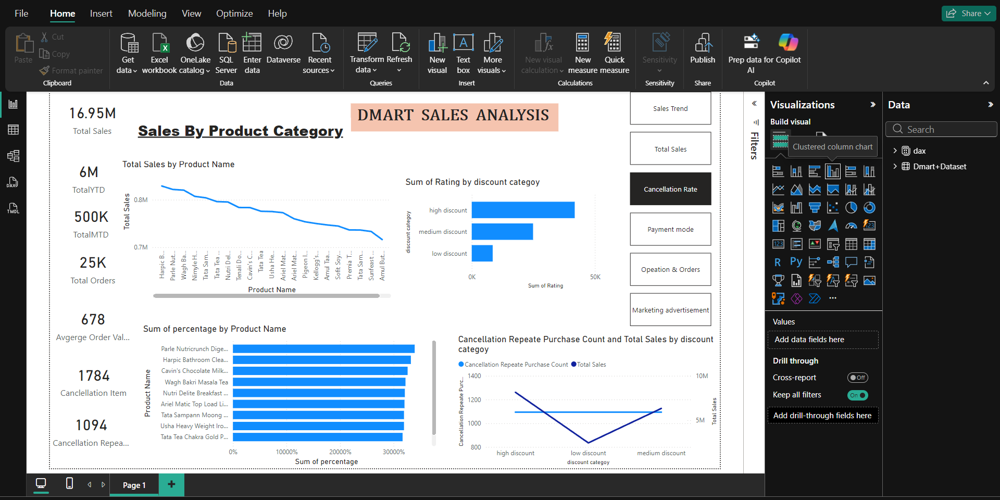

# Dmart Sales Analysis Dashboard

This dashboard provides a detailed analysis of **Dmart sales data** to help understand business performance, product trends, and customer behavior.  
It is designed to give insights into revenue, product sales, and regional performance for better decision making.

## Tools Used
- **Power BI** (for building interactive visuals)
- **DAX** (for calculations)
- **Excel** (for dataset preparation)

## Dataset
The dataset contains sales records including:
- Order Date
- Product Name
- Category
- Quantity Sold
- Unit Price
- Total Revenue
- Store / Region

## Key Insights
- Monthly and yearly revenue trends
- Top selling products and categories
- Region-wise sales performance
- Quantity sold vs revenue analysis
- Sales comparison across different time periods

## How to Use
1. Download the `.pbix` file from this repository.
2. Open the file in **Power BI Desktop**.
3. Use the interactive visuals and slicers to analyze Dmart sales trends by region, product, or month.
> **Note:** The dashboard contains multiple pages; explore all tabs in Power BI to view different insights.

## Dashboard Screenshots

**Page 1: Overview**

**Page 2: Total Sales**

**Page 3: Sales By Category**

**Page 4: Order And Cancle**

**Page 5: Oders By Delivery Time**

**Page 6: Orders By Advertisement Source And states**

---

**Author:** Bindu.s 
**Date:** December 2025
